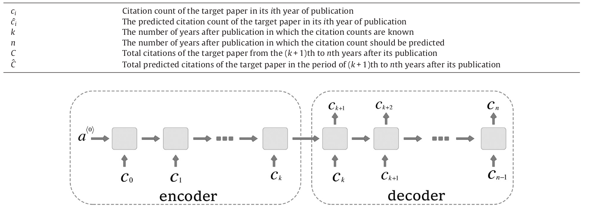
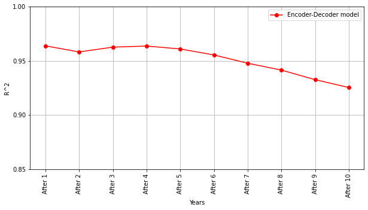

# Encoder-Decoder-Keras-implementation

Implementation of the Encoder-Decoder model proposed by Ali Abrishami and Sadegh Aliakbary in their paper "Predicting citation counts based on deep neural network learning techniques".

The authors of this paper propose an RNN (Encoder-Decoder) model to predict citation count 10 years into the future.

I also present the process of transforming, cleaning, and manpulating the dataset before feeding it to the model.

After the model is trained I check how well we predicted for each year and also choose randomly some papers to visualise the true values and the predicted ones.

Here we can also see a plot which shows that the predictions are really promising.
